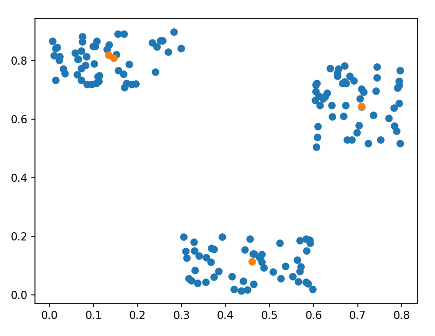
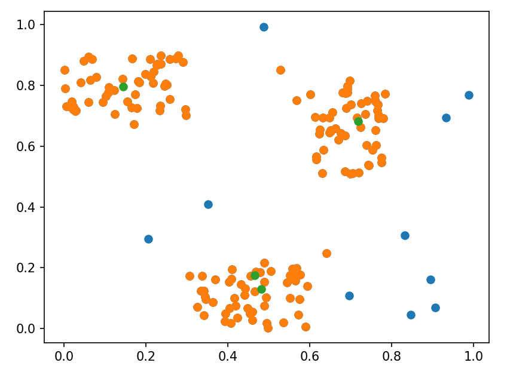

# Python Denclue implementation

A Python implementation for Denclue's algorithm in python with numpy speedup.

# Clustering
The file `test.py` shows a clustering use case. Data points with 3 visibles clusters are generated, and the algorithm is then asked to find out these clusters.

The clusters' centroids are here marked in orange.

# Denoising
The algorithm can also be use as a denoiser. It first identify clusters, and then remove points which are too distant from centroids.
We created a new dataset from the previous one, and we added a few random samples as "noise".

We here have in green clusters' centroids, in orange samples related to clusters and in blue the point counsidered as "noise" by the algorithm.
